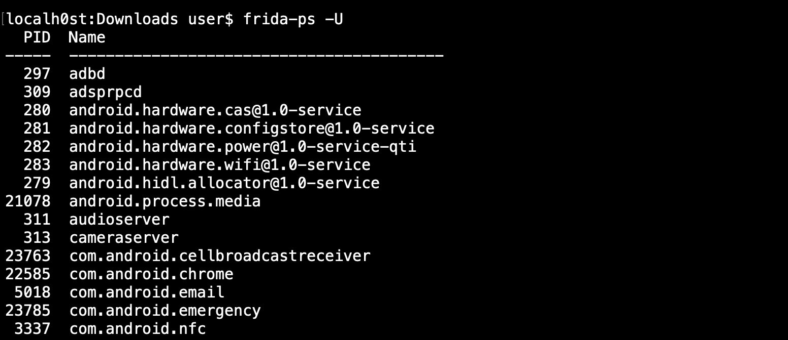

# Mobile

## Both \(Android & iOS\)

### Buscar IPs en código

`grep -E -o -r -n "(25[0-5]|2[0-4][0-9]|[01]?[0-9][0-9]?)\.(25[0-5]|2[0-4][0-9]|[01]?[0-9][0-9]?)\.(25[0-5]|2[0-4][0-9]|[01]?[0-9][0-9]?)\.(25[0-5]|2[0-4][0-9]|[01]?[0-9][0-9]?)"` **`file.txt`**


**-E:** Use extended regular expression

**-o:** Print IP addresses only

**-r:** scan files in the current directory and all sub-directories

**-n:** Show line number


### Mobile Application Penetration Testing Cheat Sheet

[https://github.com/tanprathan/MobileApp-Pentest-Cheatsheet](https://github.com/tanprathan/MobileApp-Pentest-Cheatsheet)

### Mobile Security Testing Guide \(MSTG\)

* **Official Page:** [https://www.owasp.org/index.php/OWASP\_Mobile\_Security\_Testing\_Guide](https://www.owasp.org/index.php/OWASP_Mobile_Security_Testing_Guide)
* **Mobile App Security Checklist \(Excel\):** [https://github.com/OWASP/owasp-mstg/releases](https://github.com/OWASP/owasp-mstg/releases)
* Gitbook: [https://mobile-security.gitbook.io/mobile-security-testing-guide/](https://mobile-security.gitbook.io/mobile-security-testing-guide/)

## iOS

https://github.com/OWASP/owasp-mstg/blob/master/Document/0x06c-Reverse-Engineering-and-Tampering.md

## Android

### house

A runtime mobile application analysis toolkit with a Web GUI, powered by Frida, written in Python: [https://github.com/nccgroup/house](https://github.com/nccgroup/house)

## Apktool

Disassembling Android apk file

apktool d &lt;apk file&gt; -o &lt;output folder&gt;

Rebuilding decoded resources back to binary APK/JAR with certificate signing

apktool b &lt;modified folder&gt;  
keytool -genkey -v -keystore keys/test.keystore -alias Test -keyalg RSA -keysize 1024 -sigalg SHA1withRSA -validity 10000  
jarsigner -keystore keys/test.keystore dist/test.apk -sigalg SHA1withRSA -digestalg SHA1 Test

## Frida

### Step 1 – install frida on your computer

\# installing frida via terminal, sometimes you need to run this command as sudo

### Step 2 – install frida-server on your device

Since there are a lot kind of android devices architectures we need to find out what processor have our device so we need to connect our device to the computer \(with usb debugger option activated\) and then run this following command:

\# getting the processor architecture in this case is ARM, there are also x86, x86\_64, etc ...

adb shell getprop ro.product.cpu.abi  
ouput: armeabi-v7a

Well, after know the arch now we can download the properly frida-server version for our device, in this case **frida-server-XX.X.X-android-arm** in this frida [github releases link](https://github.com/frida/frida/releases) \(since the latest version didn’t work I highly recommend download this version **frida-server-12.0.5-android-arm.xz**, anyway you can try with newer version if you want to\), once is downloaded we need to extract the frida server and then copy it to the device:

\# extracting frida-server binary from the xz file for linux distributions

tar -xJf frida-server-12.0.5-android-arm.xz

for macOS or BSD based

unxz frida-server-12.0.5-android-arm.xz

\# then we need to copy the frida-server binary to the device with adb

adb push ./frida-server-12.0.5-android-arm /data/local/tmp/

### Step 3 – Hello process in frida \(frida’s Hello world\)

Once we have installed frida \(computer\) and frida-server \(android\) we can start interacting with frida with the following commands:

\# first we need to start frida-server with this adb command the last '&' is to run the command in background

\# disable SELinux is very important I was looking about 4 hours trying to see what happened and SELinux was preventing the success frida-server execution, also frida-server must run as root

adb shell 'su -c setenforce 0'  
adb shell 'su -c /data/local/tmp/frida-server-12.0.5-android-arm &'

\# then if everything works you can see frida's hello world with **frida-ps** is for list the devices process and **-U** flag is for usb devices

### Step 5 – Setup Burp Suite community edition

The quickest way to setup a connection between our devices is get connected the android device and computer in the same wifi, so we just need to set up the android wifi connection to manual proxy in advanced section and also set up Burp Suite with the local computer ip \(don’t forget use the same port\).

Also we need to install the burpsuite certificate, once the android device have the proxy set up we need to access to http://burp in browser, then click the “CA certificate” button and download the certificate \(Note, you need to change the certificate extension from der to cer\):

### Last step: Bypass SSL pinning with Universal Android SSL Pinning Bypass No.2

So, we got frida, frida-server and burpsuite running as expected, the next step is run the **“Universal Android SSL Pinning Bypass No.2”** script in order to start sniffing the application connections so we need to get the script and saved locally as name\_script.js, here is a [blogpost about this script by Mattia Vinci](https://techblog.mediaservice.net/2018/11/universal-android-ssl-pinning-bypass-2/) \(you can add several scripts to frida from the [repo](https://codeshare.frida.re/browse) or custom scripts too\).

So the only thing that we have to do is save this script as “frida-ssl-2.js” and run the following command:

\# the -l flag is to run custom script, in this case ssl pinning 2 script

\# the -f flag is for the apk package name, --no-paus option to not interrupt

\# the app startup at all and still leave the spawning of the process to Frida.

frida -U -l frida-ssl-2.js --no-paus -f com.example.application

Then the application is going start you are going to see the results in burpsuite:

So at this point you successfully bypass the ssl pinning with frida and you can start hacking network connections on android applications.

### With Root

adb push frida-server /data/local/tmp/  
adb shell "chmod 755 /data/local/tmp/frida-server"  
adb shell "/data/local/tmp/frida-server &"

Then a connection with the Frida client is done and the instrumentation begins.

frida-ps -U

 PID NAME  
 1590 com.facebook.katana  
13194 com.facebook.katana:providers  
12326 com.facebook.orca  
13282 com.twitter.android

The injection is done with ptrace by attaching or spawning a process and then injecting the agent. Once the agent is injected, it communicates with its server through a pipe.

### Non-rooted: Objection

 ptrace can’t be used as a normal user. To address this constraint, Frida provides another mode of operation called embedded. In this mode the user is responsible to inject the frida-gadget library.

Moreover, there are some situations that is not possible to have a rooted phone but still you need to use Frida.

More info: [https://blog.netspi.com/four-ways-bypass-android-ssl-verification-certificate-pinning/](https://blog.netspi.com/four-ways-bypass-android-ssl-verification-certificate-pinning/)

objection patchapk -s test\_app.apk

adb install test\_app.objection.apk

#### Hook Only device restrictions

After the objection-altered APK has been installed on our target device, running the app should result in a pause at the application startup screen. At this point, we can connect to a Frida server that should be listening on the device. If you prefer using the Frida utilities:

objection explore

android hooking search classes TrustManager  
android sslpinning disable

If there is only a device restrictions now you can see the traffic passing across the Web-Proxy.

#### Hook App restrictions

