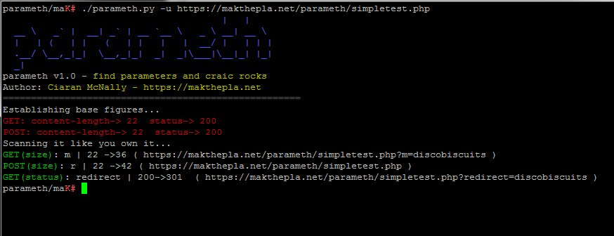

# All

Network Discovery

### Nmap

* sudo nmap -sS -Pn -v -A -p- --min-parallelism 20 --min-hostgroup 30 --max-rtt-timeout **30ms** --version all --max-retries 2 -oA **SYNAllPorts** -sC --script broadcast,discovery **Network**
  * --allports \(Don't exclude any ports from version detection\)
  * **--version all:** Enable intensity level 9. Higher possibility of correctness. Slower
  * **-A:** Enables OS detection, version detection, script scanning, and traceroute
  * **--script discovery:** Try to learn more information about target hosts through public sources of information, SNMP, directory services, and more
  * **--script broadcast:** Discover hosts not included on command line by broadcasting on local network.
* sudo nmap -PE -PP -PM --min-parallelism 20 --min-hostgroup 30 --max-rtt-timeout **30ms** --max-retries 2 -A -oA **HostDiscoveryMultpleICMP** **Network**
  * **-PE:** Use ICMP Echo Request
  * **-PP:** Use ICMP Timestamp Request
  * **-PM:** Use ICMP Netmask Request

### sn1per

**Repository:** [https://github.com/1N3/Sn1per](https://github.com/1N3/Sn1per)

**Info:** Automated Pentest Recon Scanner

* **DISCOVER:** Parses all hosts on a subnet/CIDR \(ie. 192.168.0.0/16\) and initiates a sniper scan against each host. Useful for internal network scans.
  * sudo sniper -t **&lt;CIDR&gt;** -m discover -w **&lt;WORSPACE\_ALIAS&gt;**
  * sudo sniper -t **www.domain.com** -m discover -w **workspace\_name**
* **AIRSTRIKE:** Quickly enumerates open ports/services on multiple hosts and performs basic fingerprinting. To use, specify the full location of the file which contains all hosts, IPs that need to be scanned and run ./sn1per /full/path/to/targets.txt airstrike to begin scanning.
  * sniper -f **/full/path/to/targets.txt** -m airstrike
  * sudo sniper -t **domain.com \| &lt;CIDR&gt;** -m discover -w **domain** && sudo sniper -f /usr/share/sniper/loot/**domain**/lyse/domains/targets.txt -m airstrike

### ARP Scan

* arp-scan --interface=**wlan0** --localnet
* arp-scan --interface=**wlan0** **10.0.1.0/24**

Mas Info:

* [https://www.blackmoreops.com/2015/12/31/use-arp-scan-to-find-hidden-devices-in-your-network/](https://www.blackmoreops.com/2015/12/31/use-arp-scan-to-find-hidden-devices-in-your-network/)
* [https://tools.kali.org/information-gathering/arp-scan](https://tools.kali.org/information-gathering/arp-scan)

### NetDiscover

* netdiscover -i **wlan0** -r **10.200.0.0/16**
  * -r range: scan a given range instead of auto scan. 192.168.6.0/24,/16,/8
* netdiscover -i wlan0 -p -f -P -L
  * **-P** print results in a format suitable for parsing by another program and stop after active scan
  * **-L** similar to -P but continue listening after the active scan is completed
  * **-f** enable fastmode scan, saves a lot of time, recommended for auto
  * **-p** passive mode: do not send anything, only sniff

Network Scanning

### Masive

* sudo masscan **172.16.0.0/16,10.32.0.0/16,10.200.0.0/16** -p **21,22,23,25,100-700,3389,8080** --banners -e **eth0** --open-only --max-rate **10000** -oG **output-file**
* sudo masscan 10.6.66.40 10.6.104.191 10.11.119.9 10.6.67.21 -p **21,22,23,25,100-700,3389,8080** --banners -e **cscotun0** --open-only --max-rate 100 -oG **output-file**
  * **--banners:** specifies that banners should be grabbed, like HTTP server versions, HTML title fields, and so forth. Only a few protocols are supported.
  * **--open-only:** report only open ports, not closed ports.
* zmap -p **445** -o **output-file** **172.16.0.0/16 10.32.0.0/16 10.200.0.0/16**

Network Hacking

## Responder

* sudo responder -b -f -w -v -I **eth0**

## HackerTarget Tools

**Repo:** [https://hackertarget.com/ip-tools/](https://hackertarget.com/ip-tools/)

**Info:** The following are a collection of online IP Tools that can be used to quickly get information about IP Addresses, Web Pages and DNS records.

These tools are placed here to be a quick reference whether you are assessing your organizations systems, or popping boxes on a penetration testing engagement.

Reporting

## Nmap Grep

Comprehensive parsing script for grepable Nmap output files. Provides a summary table, split hosts files, and URLs for web and SMB hosts.

**nmap-grep.sh** is meant for parsing grepable Nmap output files \(-oG\). The file must be the first parameter. **--out-dir** can be used to specify a custom output directory. If not output directory is given, **nmap-grep-YYYY-MM-DD-HH-MM-SS** will be created.

* git clone [https://github.com/actuated/nmap-grep](https://github.com/actuated/nmap-grep)
* ./nmap-grep.sh **output-nmap.gnmap** \[--out-dir \[outputdirectory\]\] \[\[options\]\]
  * This script performs the following actions, which each have different options to flag them as disabled.
  * Create a summary table for open ports as summary.txt, including the IP, port, tcp/udp, protocol, and any version information. This can be disabled with **--no-summary**.
  * Create files for each open port, listing each IP with that port open on a separate line. By default, these files will be named \[port\]-\[tcp/udp\]-hosts.txt. This can be disabled with **--no-split**.
  * Rename split hosts files for common ports and services. For example, **21-tcp-hosts.txt** becomes **ftp-hosts.txt**. This can be disabled with **--no-label-split**.
  * Create **web-urls.txt**, with URLs for every open TCP 80, 443, 8080, and 8443 service. This can be disabled with **--no-web-urls**.
  * Create **smb-urls.txt**, with URLs for every open TCP 445 service. This can be disabled with **--no-smb-urls**.
  * Create **up-hosts.txt**, listing every host that reported as "up". This can be disabled with **--no-up**.

## awesome-nmap-grep

A collection of awesome, grep-like commands for the nmap greppable output \(-oG\) format. This repository aims to serve as a quick reference to modify the output into readable formats.

All of the below commands assume the output was saved to a file called **output.grep**. The example command to produce this file as well as the sample outputs was: **nmap -v --reason 127.0.0.1 -sV -oG output.grep -p-**.

Finally, the **NMAP\_FILE** variable is set to contain **output.grep**.

### count number of open ports

* NMAP\_FILE=**output-nmap.gnmap**
* egrep -v "^\#\|Status: Up" $NMAP\_FILE \| cut -d' ' -f2,4- \| sed -n -e 's/Ignored.\*//p' \| awk -F, '{split\($0,a," "\); printf "Host: %-20s Ports Open: %d\n" , a\[1\], NF}' \| sort -k 5 -g

#### output

Host: 127.0.0.1 Ports Open: 16

### print the top 10 ports

* NMAP\_FILE=**output-nmap.gnmap**
* egrep -v "^\#\|Status: Up" $NMAP\_FILE \| cut -d' ' -f4- \| sed -n -e 's/Ignored.\*//p' \| tr ',' '\n' \| sed -e 's/^\[ \t\]\*//' \| sort -n \| uniq -c \| sort -k 1 -r \| head -n 10

#### output

1 9001/open/tcp//tor-orport?///

1 9000/open/tcp//cslistener?///

1 8080/open/tcp//http-proxy///

1 80/open/tcp//http//Caddy/

1 6379/open/tcp//redis//Redis key-value store/

1 631/open/tcp//ipp//CUPS 2.1/

1 6234/open/tcp/////

1 58377/filtered/tcp/////

1 53/open/tcp//domain//dnsmasq 2.76/

1 49153/open/tcp//mountd//1-3/

### top service identifiers

* NMAP\_FILE=**output-nmap.gnmap**
* egrep -v "^\#\|Status: Up" $NMAP\_FILE \| cut -d ' ' -f4- \| tr ',' '\n' \| sed -e 's/^\[ \t\]\*//' \| awk -F '/' '{print $7}' \| grep -v "^$" \| sort \| uniq -c \| sort -k 1 -nr

#### output

2 Caddy

2 1-3 \(RPC 100005\)

1 dnsmasq 2.76

1 Redis key-value store

1 OpenSSH 6.9 \(protocol 2.0\)

1 MySQL 5.5.5-10.1.14-MariaDB

1 CUPS 2.1

### top service names

* NMAP\_FILE=**output-nmap.gnmap**
* egrep -v "^\#\|Status: Up" $NMAP\_FILE \| cut -d ' ' -f4- \| tr ',' '\n' \| sed -e 's/^\[ \t\]\*//' \| awk -F '/' '{print $5}' \| grep -v "^$" \| sort \| uniq -c \| sort -k 1 -nr

#### output

2 mountd

2 http

1 unknown

1 tor-orport?

1 ssl\|https

1 ssh

1 redis

1 mysql

1 ipp

1 http-proxy

1 domain

1 cslistener?

### hosts and open ports

* NMAP\_FILE=**output-nmap.gnmap**
* egrep -v "^\#\|Status: Up" $NMAP\_FILE \| cut -d' ' -f2,4- \| sed -n -e 's/Ignored.\*//p' \| awk '{print "Host: " $1 " Ports: " NF-1; $1=""; for\(i=2; i&lt;=NF; i++\) { a=a" "$i; }; split\(a,s,","\); for\(e in s\) { split\(s\[e\],v,"/"\); printf "%-8s %s/%-7s %s\n" , v\[2\], v\[3\], v\[1\], v\[5\]}; a="" }'

#### output

Host: 127.0.0.1 Ports: 16

open tcp/22 ssh

open tcp/53 domain

open tcp/80 http

open tcp/443 https

open tcp/631 ipp

open tcp/3306 mysql

open tcp/4767 unknown

open tcp/6379

open tcp/8080 http-proxy

open tcp/8081 blackice-icecap

open tcp/9000 cslistener

open tcp/9001 tor-orport

open tcp/49152 unknown

open tcp/49153 unknown

filtered tcp/54695

filtered tcp/58369

### banner grab

* NMAP\_FILE=**output-nmap.gnmap**
* egrep -v "^\#\|Status: Up" $NMAP\_FILE \| cut -d ' ' -f2,4- \| awk -F, '{split\($1,a," "\); split\(a\[2\],b,"/"\); print a\[1\] " " b\[1\]; for\(i=2; i&lt;=NF; i++\) { split\($i,c,"/"\); print a\[1\] c\[1\] }}' \| xargs -L1 nc -v -w1

#### output

found 0 associations

found 1 connections:

 1: flags=82&lt;CONNECTED,PREFERRED&gt;

 outif lo0

 src 127.0.0.1 port 52224

 dst 127.0.0.1 port 3306

 rank info not available

 TCP aux info available

Connection to 127.0.0.1 port 3306 \[tcp/mysql\] succeeded!

Y

5.5.5-10.1.14-MariaDB�uds9^MIf��!?�EgVZ&gt;iv7KTD7mysql\_native\_passwordfound 0 associations

nc: connectx to 127.0.0.1 port 54695 \(tcp\) failed: Connection refused

nc: connectx to 127.0.0.1 port 58369 \(tcp\) failed: Connection refused

## Nmap to CSV

* git clone [https://github.com/maaaaz/nmaptocsv](https://github.com/maaaaz/nmaptocsv)
* cd nmaptocsv
* ~/tools/nmaptocsv/./nmaptocsv.py -i **InputFile.nmap** -f ip-port-protocol-service-version -o **OutputFile.csv**
* python nmaptocsv/nmaptocsv.py -i **InputFile.nmap** -f ip-port-protocol-service-version -o **OutputFile.csv**

Nota: Utilizar python **2.7**.

Fuerza Bruta

### Hydra - Base de Datos

SMB - NetBIOS

## SMB security level

* nmap --script smb-security-mode.nse -p 445 **&lt;PORT&gt; &lt;TARGET&gt;**
* nmap -sU -sS --script smb-security-mode.nse -p U:137,T:139,445
* nmap -p445 --script smb-protocols &lt;TARGET&gt;

Info: [http://nmap.org/nsedoc/scripts/smb-security-mode.html](http://nmap.org/nsedoc/scripts/smb-security-mode.html)

## NetBIOS Scanner

### NetBIOS Scanner

* [http://www.nirsoft.net/utils/netbios\_scanner.html](http://www.nirsoft.net/utils/netbios_scanner.html)

### Nmap nbstat

* nmap -sU --script nbstat.nse -p137 &lt;host&gt;
  * [https://nmap.org/nsedoc/scripts/nbstat.html](https://nmap.org/nsedoc/scripts/nbstat.html)

### Metasploit

* use auxiliary/scanner/smb/smb\_version
* use auxiliary/scanner/smb/smb\_enumshares
* use auxiliary/scanner/smb/smb\_lookupsid
* use auxiliary/scanner/smb/smb\_enumusers

Web

## Discovery Content

### LinkFinder

**Repository:** [https://github.com/GerbenJavado/LinkFinder](https://github.com/GerbenJavado/LinkFinder)

**Info:** A python script that finds endpoints in JavaScript files

 python ~/tools/LinkFinder/linkfinder.py -i **https://example.com/1.js** -o **results.html**

 python ~/tools/LinkFinder/linkfinder.py -i **file.txt** -o **results.html**

 python ~/tools/LinkFinder/linkfinder.py -i **https://example.com** -d -o **results.html**

## Discovery Domains

### amass

**Repository:** [https://github.com/OWASP/Amass](https://github.com/OWASP/Amass)

**Info:** In-Depth DNS Enumeration and Network Mapping. The OWASP Amass tool suite obtains subdomain names by scraping data sources, recursive brute forcing, crawling web archives, permuting/altering names and reverse DNS sweeping. Additionally, Amass uses the IP addresses obtained during resolution to discover associated netblocks and ASNs. All the information is then used to build maps of the target networks.

* sudo docker build -t amass https://github.com/OWASP/Amass.git
* sudo docker run amass --passive -d **example.com**

**Enable active recon methods**

* sudo docker run amass -active -d **example.com** net -p 80,443,8080

**A purely passive mode of execution**

* amass -passive -d domain.com

### sn1per

**Repository:** [https://github.com/1N3/Sn1per](https://github.com/1N3/Sn1per)

**Info:** Automated Pentest Recon Scanner

* STEALTH: **Quickly enumerate single targets using mostly non-intrusive scans to avoid WAF/IPS blocking.**
  * sniper -t &lt;TARGET&gt; -m stealth -o -re -w workspace\_name
  * sniper -t **www.domain.com** -m stealth -o -re -w **domain**

### Dirhunt

**Repository:** [https://github.com/Nekmo/dirhunt](https://github.com/Nekmo/dirhunt)

**Info:** Find web directories without bruteforce. Dirhunt is a web crawler optimize for search and analyze directories. This tool can find interesting things if the server has the "index of" mode enabled. Dirhunt is also useful if the directory listing is not enabled. It detects directories with false 404 errors, directories where an empty index file has been created to hide things and much more.

**Examples**

* dirhunt [**http://website.com/**](http://website.com/)
* **dirhunt** [http://website.com/](http://website.com/) &gt; directories.txt
* Examples: http://docs.nekmo.org/dirhunt/usage.html

### Gobuster

**Repository:** [https://github.com/OJ/gobuster](https://github.com/OJ/gobuster)

**Info:** Directory/file & DNS busting tool written in Go Gobuster is a tool used to brute-force:

* URIs \(directories and files\) in web sites.
* DNS subdomains \(with wildcard support\).

**Obs:**

* Se puede instalar directamente desde Kali con _**apt-get install gobuster**_.

**Examples:**

* \#\# Con Proxy
* gobuster -a "Mozilla/5.0 \(Windows NT 10.0; Win64; x64; rv:59.0\) Gecko/20100101 Firefox/59.0" -e -fw -r -u **domain.com** -p http://127.0.0.1:8081 -v -w /usr/share/wordlists/dirb/big.txt
* \#\# Sin Proxy
* gobuster -a "Mozilla/5.0 \(Windows NT 10.0; Win64; x64; rv:59.0\) Gecko/20100101 Firefox/59.0" -e -fw -r -u **http://www.domain.com/** -w /usr/share/wordlists/SecLists/Discovery/Web-Content/apache.txt

### dirb

**Repo:** [http://dirb.sourceforge.net/](http://dirb.sourceforge.net/)

**Info:** DIRB is a Web Content Scanner. It looks for existing \(and/or hidden\) Web Objects. It basically works by launching a dictionary based attack against a web server and analizing the response.

DIRB comes with a set of preconfigured attack wordlists for easy usage but you can use your custom wordlists. Also DIRB sometimes can be used as a classic CGI scanner, but remember is a content scanner not a vulnerability scanner.

DIRB main purpose is to help in professional web application auditing. Specially in security related testing. It covers some holes not covered by classic web vulnerability scanners. DIRB looks for specific web objects that other generic CGI scanners can't look for. It doesn't search vulnerabilities nor does it look for web contents that can be vulnerables.

**Examples:**

* dirb **https://domain.com** /dir/wordlist.txt -w -o **output.txt** -l -i
* dirb **https://domain.com** /usr/share/wordlists/SecLists/Discovery/Web-Content/big.txt -w -o **output.txt** -l -i
* dirb **https://domain.com** /usr/share/wordlists/SecLists/Discovery/Web-Content/big.txt -w -o **output.txt** -l -i -a "Mozilla/5.0 \(Windows NT 10.0; Win64; x64\) AppleWebKit/537.36 \(KHTML, like Gecko\) Chrome/71.0.3578.98 Safari/537.36" -N 403

dirb https://domain.com /usr/share/wordlists/SecLists/Discovery/Web-Content/merged.txt -l -a "Mozilla/5.0 \(Windows NT 10.0; Win64; x64; rv:66.0\) Gecko/20100101 Firefox/66.0" -w

* dirb **https://domain.com** /usr/share/wordlists/SecLists/Discovery/Web-Content/big.txt -w -o **domain.com.dirb** -l -i -a "Mozilla/5.0 \(Windows NT 10.0; Win64; x64\) AppleWebKit/537.36 \(KHTML, like Gecko\) Chrome/71.0.3578.98 Safari/537.36"

### wfuzz

**Repo:** [https://github.com/xmendez/wfuzz](https://github.com/xmendez/wfuzz)

**Info:** Wfuzz has been created to facilitate the task in web applications assessments and it is based on a simple concept: it replaces any reference to the FUZZ keyword by the value of a given payload.

**Examples:**

* wfuzz -c -R 10 -w /usr/share/wfuzz/wordlist/general/megabeast.txt **http://www.domain.com**/FUZZ
* wfuzz -cvL -X FUZZ -R 10 -w /usr/share/wfuzz/wordlist/general/megabeast.txt -u **http://www.domain.com**

### blacksheepwall

**Repo:** [https://github.com/tomsteele/blacksheepwall](https://github.com/tomsteele/blacksheepwall)

**Info:** blacksheepwall is a hostname reconnaissance tool

**Examples**

* ~/tools./blacksheepwall\_linux\_amd64.1 -censys -crtsh -vt -srv -axfr -headers -tls -domain **www.domain.com 200.123.123.123**
* home/pcastagnaro/tools/./blacksheepwall\_linux\_amd64 -censys fce44397-591d-4606-af29-dd88b81c6a92:HjblOaMynlbQQkeBVckyBox0Y2PiKTII -reverse -exfiltrated -clean -fcrdns -shodan Z1q2RpmJnzdtrarh6PzaMMpC1A3rwtgE -crtsh -vt -srv -axfr -headers -tls -domain **domain.com**

### massdns

**Repo:** [https://github.com/blechschmidt/massdns](https://github.com/blechschmidt/massdns)

**Info:** MassDNS is a simple high-performance DNS stub resolver targetting those who seek to resolve a massive amount of domain names in the order of millions or even billions. Without special configuration, MassDNS is capable of resolving over 350,000 names per second using publicly available resolvers.

### dns-parallel-prober

**Repo:** [https://github.com/lorenzog/dns-parallel-prober](https://github.com/lorenzog/dns-parallel-prober)

**Info:** This is a parallelised domain name prober to find as many subdomains of a given domain as fast as possible.

PLEASE NOTE this script probes DNS servers actively, so please use at your own risk. You are likely to get blacklisted and/or saturate your bandwidth. Whatever you do, it's your responsibility to make sure you have approval for it.

### subdomain\_scanner

**Repo:** [https://github.com/cr4shcod3/subdomain\_scanner](https://github.com/cr4shcod3/subdomain_scanner)

**Info:** Subdomain Scanner is a python tool designed to enumerate subdomains on a target domain through a wordlist.

**Examples**

* python subdomain.py -u **http://example.com**
* python subdomain.py -u **http://example.com** -l 100
* python subdomain.py -u **http://example.com** -cl filename.txt
* python subdomain.py -u **http://example.com** -l 100 -o **filename.txt**

### subbrute

**Repo:** [https://github.com/TheRook/subbrute](https://github.com/TheRook/subbrute)

**Info:** SubBrute is a community driven project with the goal of creating the fastest, and most accurate subdomain enumeration tool. Some of the magic behind SubBrute is that it uses open resolvers as a kind of proxy to circumvent DNS rate-limiting \(https://www.us-cert.gov/ncas/alerts/TA13-088A\). This design also provides a layer of anonymity, as SubBrute does not send traffic directly to the target's name servers.

### Leviathan Framework

**Repo:** [https://github.com/leviathan-framework/leviathan](https://github.com/leviathan-framework/leviathan)

**Info:** Leviathan is a mass audit toolkit which has wide range service discovery, brute force, SQL injection detection and running custom exploit capabilities. It consists open source tools such masscan, ncrack, dsss and gives you the flexibility of using them with a combination.

The main goal of this project is auditing as many system as possible in country-wide or in a wide IP range.

### Trape

**Repo:** [https://github.com/boxug/trape](https://github.com/boxug/trape)

**Info:** Trape is a recognition tool that allows you to track people, the information you can get is very detailed. We want to teach the world through this, as large Internet companies could monitor you, obtaining information beyond your IP.

### Sublist3r

**Repo:** [https://github.com/aboul3la/Sublist3r](https://github.com/aboul3la/Sublist3r)

**Info:** Sublist3r is a python tool designed to enumerate subdomains of websites using OSINT. It helps penetration testers and bug hunters collect and gather subdomains for the domain they are targeting. Sublist3r enumerates subdomains using many search engines such as Google, Yahoo, Bing, Baidu, and Ask. Sublist3r also enumerates subdomains using Netcraft, Virustotal, ThreatCrowd, DNSdumpster, and ReverseDNS.

[subbrute]() was integrated with Sublist3r to increase the possibility of finding more subdomains using bruteforce with an improved wordlist. The credit goes to TheRook who is the author of subbrute.

**Examples**

* python sublist3r.py -e google,yahoo,virustotal -d **example.com**
* python sublist3r.py -b -d **example.com**
* python sublist3r.py -d **example.com** -p **80,443** -o **output.txt**
* python ~/tools/Sublist3r/sublist3r.py -b -d **example.com**

### cloudflare\_enum

**Repo:** [https://github.com/mandatoryprogrammer/cloudflare\_enum](https://github.com/mandatoryprogrammer/cloudflare_enum)

**Info:** A simple tool to allow easy querying of Cloudflare's DNS data written in Python.

### censys.py

**Repo:** [https://gist.github.com/anshumanbh/96a0b81dfe318e9e956013209e178fa9](https://gist.github.com/anshumanbh/96a0b81dfe318e9e956013209e178fa9)

**Info:** Quick and Dirty script to use the Censys API to query subdomains of a target domain

### RobotsDisallowed

**Repo:** [https://github.com/danielmiessler/RobotsDisallowed](https://github.com/danielmiessler/RobotsDisallowed)

**Info:** The RobotsDisallowed project is a harvest of the Disallowed directories from the robots.txt files of the world's top websites--specifically the Alexa 100K.

This list of Disallowed directories is a great way to supplement content discovery during a web security assessment, since the website owner is basically saying "Don't go here; there's sensitive stuff in there!".

It's basically a list of potential high-value targets.

### Parameth

**Repo:** [https://github.com/maK-/parameth](https://github.com/maK-/parameth)

**Info:** This tool can be used to brute discover GET and POST parameters

Often when you are busting a directory for common files, you can identify scripts \(for example test.php\) that look like they need to be passed an unknown parameter. This hopefully can help find them.

The -off flag allows you to specify an offset \(helps with dynamic pages\) so for example, if you were getting alternating response sizes of 4444 and 4448, set the offset to 5 and it will only show the stuff outside the norm

### psychoPATH

**Repo:** [https://github.com/ewilded/psychopath](https://github.com/ewilded/psychopath)

**Info:** This tool is a highly configurable payload generator detecting LFI & web root file uploads. Involves advanced path traversal evasive techniques, dynamic web root list generation, output encoding, site map-searching payload generator, LFI mode, nix & windows support plus single byte generator.

### HostileSubBruteforcer

**Repo:** [https://github.com/nahamsec/HostileSubBruteforcer](https://github.com/nahamsec/HostileSubBruteforcer)

**Info:** This app will bruteforce for exisiting subdomains and provide the following information:

* IP address
* Host

if the 3rd party host has been properly setup. \(for example if site.example.com is poiting to a nonexisiting Heroku subdomain, it'll alert you\) -&gt; Currently only works with AWS, Github, Heroku, shopify, tumblr and squarespace.

There may be some false positives depending on the host configurations. \(Tried to take them out as much as possible\) Also works recursively at the end to get the subdomains under the ones that it has already found and dumps all your data into an output.txt file just in case \(fresh one gets created at the beginning of each process\)

More info [http://labs.detectify.com/post/109964122636/hostile-subdomain-takeover-using](http://labs.detectify.com/post/109964122636/hostile-subdomain-takeover-using)

### tko-subs

**Repo:** [https://github.com/anshumanbh/tko-subs](https://github.com/anshumanbh/tko-subs)

**Info:** This tool allows:

* To check whether a subdomain has a dangling CNAME pointing to a CMS provider \(Heroku, Github, Shopify, Amazon S3, Amazon CloudFront, etc.\) that can be taken over.
* To actually take over those subdomain by providing a flag -takeover. Currently, take over is only supported for Github Pages and Heroku Apps and by default the take over functionality is off.
* To specify your own CMS providers and check for them via the providers-data.csv file. In that file, you would mention the CMS name, their CNAME value, their string that you want to look for and whether it only works over HTTP or not. Check it out for some examples.

### AQUATONE

**Repo:** [https://github.com/michenriksen/aquatone/](https://github.com/michenriksen/aquatone/)

**Info:** AQUATONE is a set of tools for performing reconnaissance on domain names. It can discover subdomains on a given domain by using open sources as well as the more common subdomain dictionary brute force approach. After subdomain discovery, AQUATONE can then scan the hosts for common web ports and HTTP headers, HTML bodies and screenshots can be gathered and consolidated into a report for easy analysis of the attack surface.

#### Install

* gpg --keyserver hkp://keys.gnupg.net --recv-keys 409B6B1796C275462A1703113804BB82D39DC0E3 7D2BAF1CF37B13E2069D6956105BD0E739499BDB
* \curl -sSL https://get.rvm.io \| bash -s stable
* sudo gem install aquatone

#### Aquatone One-liner

$ echo "aquatone-discover -d \$1 && aquatone-scan -d \$1 --ports huge && aquatone-takeover -d \$1 && aquatone-gather -d \$1" &gt;&gt; aqua.sh && chmod +x aqua.sh

$./aqua.sh _**domain.com**_

### Gitrob

**Repo:** [https://github.com/michenriksen/gitrob](https://github.com/michenriksen/gitrob)

**Info:** Gitrob is a command line tool which can help organizations and security professionals find sensitive information lingering in publicly available files on GitHub. The tool will iterate over all public organization and member repositories and match filenames against a range of patterns for files that typically contain sensitive or dangerous information.

Looking for sensitive information in GitHub repositories is not a new thing, it has been known for a while that things such as private keys and credentials can be found with GitHub's search functionality, however Gitrob makes it easier to focus the effort on a specific organization.

### Truffle Hog

**Repo:** [https://github.com/dxa4481/truffleHog](https://github.com/dxa4481/truffleHog)

**Info:** Searches through git repositories for secrets, digging deep into commit history and branches. This is effective at finding secrets accidentally committed.

### DNSdumpster

**Repo:** [https://dnsdumpster.com/](https://dnsdumpster.com/)

**Info:** DNSdumpster.com is a FREE domain research tool that can discover hosts related to a domain. Finding visible hosts from the attackers perspective is an important part of the security assessment process.

### PublicWWW

**Repo:** [https://publicwww.com/](https://publicwww.com/)

**Info:** Ultimate solution for digital marketing and affiliate marketing research, PublicWWW allow you to perform searches this way, something that is not possible with other regular search engines.

### Reverse IP Lookup

**Repo:** [http://reverseip.domaintools.com/](http://reverseip.domaintools.com/)

**Info:** Enter an IP address and our patented Reverse IP Lookup tool will show you all of the domains currently hosted there. Results include all gTLD domains and any known ccTLD domains. Lookups are free for DomainTools Personal and Enterprise Members, for IPs with up to 2,000 hosted domains.

### ThreatCrowd

**Repo:** [https://threatcrowd.org/](https://threatcrowd.org/)

**Info:** A Search Engine for Threats. Search by Domain, IP, Email or Organization

### MX Lookup

**Repo:** [https://mxtoolbox.com/](https://mxtoolbox.com/)

**Info:** This test will list MX records for a domain in priority order. The MX lookup is done directly against the domain's authoritative name server, so changes to MX Records should show up instantly. You can click Diagnostics , which will connect to the mail server, verify reverse DNS records, perform a simple Open Relay check and measure response time performance. You may also check each MX record \(IP Address\) against 105 DNS based blacklists . \(Commonly called RBLs, DNSBLs\)

### IPv4info

**Repo:** [http://ipv4info.com/](http://ipv4info.com/)

**Info:** Key features: ipv4 networks registration data; ipv4 address allocation table; all domains for IP address; all domains in registered network block; Autonomous systems registration data, its originated prefixes and peers.

### VirusTotal domain information

**Repo:** [https://www.virustotal.com/en-gb/domain/](https://www.virustotal.com/en-gb/domain/google.com/information/)[_**google.com**_](https://www.virustotal.com/en-gb/domain/google.com/information/)[/information/](https://www.virustotal.com/en-gb/domain/google.com/information/)

**Info:** VirusTotal's passive DNS only stores address records. This domain has been seen to resolve to the following IP addresses.

### crt.sh Certificate Search

**Repo:** [https://crt.sh/](https://crt.sh/)

**Info:** Enter an Identity \(Domain Name, Organization Name, etc\), a Certificate Fingerprint \(SHA-1 or SHA-256\) or a crt.sh ID.

### Informe de transparencia de Google

**Repo:** [https://transparencyreport.google.com/https/certificates](https://transparencyreport.google.com/https/certificates)

**Info:** Busca todos los certificados de un dominio que estén presentes en los registros de transparencia de certificados públicos activos. Esto devuelve los subdominios de un dominio.

### Pentest-Tools

**Repo:** [https://pentest-tools.com/information-gathering/google-hacking](https://pentest-tools.com/information-gathering/google-hacking)

**Info:** Every penetration test should start with a passive reconnaissance phase. Since public search engines have gathered huge amounts of information about almost every website from the Internet, it is a good idea to make some queries and get this information from them. Very often you will find sensitive information or data that is not supposed to be public.

### Wayback Machine

**Repo:** [https://archive.org/web/](https://archive.org/web/)

**Info:** Explore more than 327 billion web pages saved over time

### gitgrepper

**Repo:** [https://gist.github.com/EdOverflow/a9aad69a690d97a8da20cd4194ca6596](https://gist.github.com/EdOverflow/a9aad69a690d97a8da20cd4194ca6596)

**Info:** Simple Bash script to find interesting data in GIT logs.

### Recon-ng

**Repo:** [https://bitbucket.org/LaNMaSteR53/recon-ng](https://bitbucket.org/LaNMaSteR53/recon-ng)

**Info:** econ-ng is a full-featured Web Reconnaissance framework written in Python. Complete with independent modules, database interaction, built in convenience functions, interactive help, and command completion, Recon-ng provides a powerful environment in which open source web-based reconnaissance can be conducted quickly and thoroughly.

Recon-ng has a look and feel similar to the Metasploit Framework, reducing the learning curve for leveraging the framework. However, it is quite different. Recon-ng is not intended to compete with existing frameworks, as it is designed exclusively for web-based open source reconnaissance. If you want to exploit, use the Metasploit Framework. If you want to social engineer, use the Social-Engineer Toolkit. If you want to conduct reconnaissance, use Recon-ng! See the Usage Guide for more information.

Recon-ng is a completely modular framework and makes it easy for even the newest of Python developers to contribute. Each module is a subclass of the "module" class. The "module" class is a customized "cmd" interpreter equipped with built-in functionality that provides simple interfaces to common tasks such as standardizing output, interacting with the database, making web requests, and managing API keys. Therefore, all the hard work has been done. Building modules is simple and takes little more than a few minutes. See the Development Guide for more information.

### enumall.py

**Repo:** [https://github.com/jhaddix/domain](https://github.com/jhaddix/domain)

**Info:** Script to enumerate subdomains, leveraging recon-ng. Uses google scraping, bing scraping, baidu scraping, yahoo scarping, netcraft, and bruteforces to find subdomains. Plus resolves to IP.

 ./enumall.py -a **domain1.com**

### Altdns - Subdomain discovery through alterations and permutations

**Repo:** [https://github.com/infosec-au/altdns](https://github.com/infosec-au/altdns)

**Info:** Altdns is a DNS recon tool that allows for the discovery of subdomains that conform to patterns. Altdns takes in words that could be present in subdomains under a domain \(such as test, dev, staging\) as well as takes in a list of subdomains that you know of.

From these two lists that are provided as input to altdns, the tool then generates a massive output of "altered" or "mutated" potential subdomains that could be present. It saves this output so that it can then be used by your favourite DNS bruteforcing tool.

Alternatively, the -r flag can be passed to altdns so that once this output is generated, the tool can then resolve these subdomains \(multi-threaded\) and save the results to a file.

Altdns works best with large datasets. Having an initial dataset of 200 or more subdomains should churn out some valid subdomains via the alterations generated.

### RobotsDisallowed

**Repo:** [https://github.com/danielmiessler/RobotsDisallowed](https://github.com/danielmiessler/RobotsDisallowed)

**Info:** The RobotsDisallowed project is a harvest of the Disallowed directories from the robots.txt files of the world's top websites--specifically the Alexa 100K.

This list of Disallowed directories is a great way to supplement content discovery during a web security assessment, since the website owner is basically saying "Don't go here; there's sensitive stuff in there!".

It's basically a list of potential high-value targets.

### Maltego

**Repo:** [https://www.paterva.com/web7/](https://www.paterva.com/web7/)

**Info:** Maltego CE is the community edition of Maltego and is available for free for everyone after a quick registration. It offers the same functionality as Maltego Classic with a few limitations.

## ANALYZE

### CORStest

**Repo:** [https://github.com/RUB-NDS/CORStest](https://github.com/RUB-NDS/CORStest)

**Info:** A simple CORS misconfiguration scanner

* python ~/tools/CORStest/corstest.py **domainfile.txt**

## WEB CONTENT

### Ground control

**Repo:** [https://github.com/jobertabma/ground-control](https://github.com/jobertabma/ground-control)

**Info:** This is a collection of most of my scripts that I use to debug Server Side Request Forgery \(SSRF\), blind XSS, and insecure XXE processing vulnerabilities. This is still a work in progress, as I'm still collecting all the scripts that I have lingering around. Before using these scripts, I used to rewrite these scripts most of the time or set up listeners with netcat. That wasn't scalable, so I started collecting the scripts in a repository, which can be closed easily every time it's needed it on a server.

### Sleepy Puppy

**Repo:** [https://github.com/Netflix/sleepy-puppy](https://github.com/Netflix/sleepy-puppy)

**Info:** Sleepy Puppy is a cross-site scripting \(XSS\) payload management framework which simplifies the ability to capture, manage, and track XSS propagation over long periods of time.

### XSSHunter

**Repo:** [https://github.com/mandatoryprogrammer/xsshunter](https://github.com/mandatoryprogrammer/xsshunter)

**Info:** This is a portable version of the source code running on https://xsshunter.com. It is designed to be easily-installable on any server for security professionals and bug bounty hunters who wish to test for XSS in a much more powerful way.

If you don't want to set up this software and would rather just start testing, see [https://xsshunter.com](https://xsshunter.com/).

### tplmap

**Repo:** [https://github.com/epinna/tplmap](https://github.com/epinna/tplmap)

**Info:** Tplmap assists the exploitation of Code Injection and Server-Side Template Injection vulnerabilities with a number of sandbox escape techniques to get access to the underlying operating system.

The tool and its test suite are developed to research the SSTI vulnerability class and to be used as offensive security tool during web application penetration tests.

The sandbox break-out techniques came from James Kett's Server-Side Template Injection: RCE For The Modern Web App, other public researches \[1\] \[2\], and original contributions to this tool \[3\] \[4\].

It fully compromises the server exploiting several code context and blind injection scenarios. It also supports eval\(\)-like code injections in Python, Ruby, PHP, Java and generic unsandboxed template engines.

### psychoPATH

**Repo:** [https://github.com/ewilded/psychopath](https://github.com/ewilded/psychopath)

**Info:** This tool is a highly configurable payload generator detecting LFI & web root file uploads. Involves advanced path traversal evasive techniques, dynamic web root list generation, output encoding, site map-searching payload generator, LFI mode, nix & windows support plus single byte generator.

### Commix

**Repo:** [https://github.com/commixproject/commix](https://github.com/commixproject/commix)

**Info:** Commix \(short for \[comm\]and \[i\]njection e\[x\]ploiter\) is an automated tool written by Anastasios Stasinopoulos \(@ancst\) that can be used from web developers, penetration testers or even security researchers in order to test web-based applications with the view to find bugs, errors or vulnerabilities related to command injection attacks. By using this tool, it is very easy to find and exploit a command injection vulnerability in a certain vulnerable parameter or HTTP header.

### XSS Radar

**Repo:** [https://github.com/bugbountyforum/XSS-Radar](https://github.com/bugbountyforum/XSS-Radar)

**Info:** XSS Radar is a tool that detects parameters and fuzzes them for cross-site scripting vulnerabilities.

### Security headers

**Repo:** [https://securityheaders.com/](https://securityheaders.com/)

**Info:** I built Security Headers after deploying security headers like CSP and HSTS to my own site. I wanted a quick and easy way to check if other sites were using these headers and I figured I'd turn it into a useful tool for everyone to use!

### Burp Suite

**Repo:**

### Plugins

* **VulnersCom:** https://github.com/vulnersCom/burp-vulners-scanner
* **BackSlash-powered-scanner:** https://github.com/PortSwigger/backslash-powered-scanner
* **Header Checks:** https://github.com/eonlight/BurpExtenderHeaderChecks
* **pyschPATH:** https://github.com/ewilded/psychopath

Dictionaries

### jhaddix/all.txt

**Repo:** [https://gist.github.com/jhaddix/86a06c5dc309d08580a018c66354a056](https://gist.github.com/jhaddix/86a06c5dc309d08580a018c66354a056)

**Info:** all wordlists for every dns enumeration tool... ever.

### SecLists

**Repo:** [https://github.com/danielmiessler/SecLists](https://github.com/danielmiessler/SecLists)

**Info:** SecLists is the security tester's companion. It's a collection of multiple types of lists used during security assessments, collected in one place. List types include usernames, passwords, URLs, sensitive data patterns, fuzzing payloads, web shells, and many more. The goal is to enable a security tester to pull this repo onto a new testing box and have access to every type of list that may be needed.

### SVNDigger

**Repo:** [https://www.netsparker.com/s/research/SVNDigger.zip](https://www.netsparker.com/s/research/SVNDigger.zip)

**Info:** Initially we needed to find lots of public SVN/CSV. So far we only used Google Code and Sourceforge. We did filtered search such as "Only PHP" or "Only ASP" projects. After this we used FSF \(Freakin' Simple Fuzzer\) to scrape, it was a one liner.

After we had the list of all open source projects, we wrote couple of simple batch files to start getting list of files via SVN and CVS clients.

When all finished, we coded a small client to analyse the all repository outputs and load them into an SQL Server database. Later on we applied many filters with yet another small script and generated all these different wordlists to use in different scenarios.

OSINT

### Karma

**Repo:** https://github.com/decoxviii/karma

**Info:** Find leaked emails with your passwords.

#### Install

sudo apt install tor python3 python3-pip

git clone https://github.com/decoxviii/karma.git ; cd karma

sudo -H pip3 install -r requirements.txt

python3 bin/karma.py --help

#### Search emails with the password: 123456789

sudo service tor start && ~/tools/karma/bin/./karma search '123456789' --password -o output1

#### Search emails with the local-part: johndoe

sudo service tor start && ~/tools/karma/bin/./karma search 'johndoe' --local-part -o output2

#### Search emails with the domain: hotmail.com

sudo service tor start && ~/tools/karma/bin/./karma search 'hotmail.com' --domain -o output3

#### Search email password: [johndoe@unknown.com](mailto:johndoe@unknown.com)

sudo service start tor && python3 bin/karma.py target 'johndoe@unknown.com' -o output4

Web Services

### WSSAT

**Repo:** [https://github.com/YalcinYolalan/WSSAT](https://github.com/YalcinYolalan/WSSAT)

**Info:** WSSAT is an open source web service security scanning tool which provides a dynamic environment to add, update or delete vulnerabilities by just editing its configuration files. This tool accepts WSDL address list as input file and for each service, it performs both static and dynamic tests against the security vulnerabilities. It also makes information disclosure controls. With this tool, all web services could be analysed at once and the overall security assessment could be seen by the organization.

## SQLmap

### Automated sqlmap scan

sqlmap -u **http://site.com** --forms --batch --crawl=2 --cookie= --level=5 --risk=3

### \# Test URL and POST data and return database banner \(if possible\)

./sqlmap.py --url="&lt;url&gt;" --data="&lt;post-data&gt;" --banner

### \# Parse request data and test \| request data can be obtained with burp

./sqlmap.py -u &lt;request-file&gt; &lt;options&gt;

### \# Use random agent

./sqlmap.py -u &lt;request-file&gt; --random-agent

### \# Fingerprint \| much more information than banner

./sqlmap.py -u &lt;request-file&gt; --fingerprint

### \# Identify WAF

./sqlmap.py -u &lt;request-file&gt; --check-waf/--identify

### \# Get database username, name, and hostname

./sqlmap.py -u &lt;request-file&gt; --current-user --current-db --hostname

### \# Check if user is a database admin

./sqlmap.py -u &lt;request-file&gt; --is-dba

### \# Get database users and password hashes

./sqlmap.py -u &lt;request-file&gt; --users --passwords

### \# Enumerate databases

./sqlmap.py -u &lt;request-file&gt; --dbs

### \# List tables for one database

./sqlmap.py -u &lt;request-file&gt; -D &lt;db-name&gt; --tables

### \# Other database commands

./sqlmap.py -u &lt;request-file&gt; -D &lt;db-name&gt; --columns

 --schema

 --count

### \# Enumeration flags

./sqlmap.py -u &lt;request-file&gt; -D &lt;db-name&gt;

 -T &lt;tbl-name&gt;

 -C &lt;col-name&gt;

 -U &lt;user-name&gt;

### \# Extract data

./sqlmap.py -u &lt;request-file&gt; -D &lt;db-name&gt; -T &lt;tbl-name&gt; -C &lt;col-name&gt; --dump

### \# Execute SQL Query

./sqlmap.py -u &lt;request-file&gt; --sql-query="&lt;sql-query&gt;"

### \# Append/Prepend SQL Queries

./sqlmap.py -u &lt;request-file&gt; --prefix="&lt;sql-query&gt;" --suffix="&lt;sql-query&gt;"

### \# Get backdoor access to sql server \| can give shell access

./sqlmap.py -u &lt;request-file&gt; --os-shell

### Usando Proxy y SSL

sqlmap -r request2.txt --proxy http://192.168.0.3:8080 --level=5 --risk=3 -v 3 --force-ssl -f --random-agent -a

## Detectar WAF

### WAFw00f

 Descargar [https://github.com/EnableSecurity/wafw00f](https://github.com/EnableSecurity/wafw00f)

 sudo python setup.py install

 wafw00f &lt;URL&gt;

### nmap http-waf-detect

info: [https://nmap.org/nsedoc/scripts/http-waf-detect.html](https://nmap.org/nsedoc/scripts/http-waf-detect.html)

 nmap -p &lt;PORT&gt; --script http-waf-detect &lt;HOST&gt;

nmap -p &lt;PORT&gt; --script http-waf-detect --script-args="http-waf-detect.aggro,http-waf-detect.uri=**/testphp.vulnweb.com/artists.php**" &lt;HOST&gt;

### nmap http-waf-fingerprint

info: [https://nmap.org/nsedoc/scripts/http-waf-fingerprint.html](https://nmap.org/nsedoc/scripts/http-waf-fingerprint.html)

 nmap -p &lt;PORT&gt; --script=http-waf-fingerprint &lt;targets&gt;

nmap -p &lt;PORT&gt; --script=http-waf-fingerprint --script-args http-waf-fingerprint.intensive=1 &lt;HOST&gt;

## SSL

### HSTS

* nmap -p **443** --script http-hsts-verify -Pn -v -oA http-hsts-verify **&lt;TARGET&gt;**
* curl -I -k [https://xxx.xxx.com](https://xxx.xxx.com/)
  * El curl debería mostrar algo como: _Strict-Transport-Security: max-age=15552000; preload_

Info:

### POODLE

* nmap -sV --version-light --script ssl-poodle -p &lt;PORT&gt; &lt;TARGET&gt;

Info: [http://nmap.org/nsedoc/scripts/ssl-poodle.html](http://nmap.org/nsedoc/scripts/ssl-poodle.html)

### SSL DROWN

* nmap -sV --script=sslv2-drown -p **443** -Pn -v -oA sslv2-drown **&lt;TARGET&gt;**

### HEARTBLEED

* nmap --script ssl-heartbleed --script-args vulns.showall -oA ssl-heartbleed -Pn -p **443** -sV **&lt;TARGET&gt;**

Info: [https://gist.github.com/bonsaiviking/10402038](https://gist.github.com/bonsaiviking/10402038)

Info: [http://nmap.org/nsedoc/scripts/ssl-heartbleed.html](http://nmap.org/nsedoc/scripts/ssl-heartbleed.html)

### Shellshock

### Obtener Certificados

* nmap -sV -sC -vv -oA certificadosSSL -Pn -p **443 &lt;target&gt;**

info: [https://nmap.org/nsedoc/scripts/ssl-cert.html](https://nmap.org/nsedoc/scripts/ssl-cert.html)

* openssl s\_client -connect &lt;TARGET&gt;:&lt;PORT&gt;
* echo \| openssl s\_client --showcerts --connect &lt;target:port&gt; \| awk 'BEGIN{p="openssl x509 -noout -text"} {print \|p} /-----END/{close\(p\)}'

### Enumerar cifrados

* nmap --script ssl-enum-ciphers -Pn -p **443** -oA ssl-enum-ciphers **&lt;TARGET&gt;**

Info: [http://nmap.org/nsedoc/scripts/ssl-enum-ciphers.html](http://nmap.org/nsedoc/scripts/ssl-enum-ciphers.html)

### Sweet32: Vulnerabilidad del tipo "Birthday" en bloques de cifrado TLS de 64 bit

#### Nmap

 nmap --script ssl-enum-ciphers -p 443 &lt;TARGET&gt;

#### YAWAST

sudo docker pull adamcaudill/yawast && sudo docker run --rm adamcaudill/yawast scan **https://www.domain.com** --tdessessioncount

_This is the recommended option, especially if you need to perform the SWEET32 test \(--tdessessioncount\), due to OpenSSL dropping support for the 3DES cipher suites._

_In this case I’m using YAWAST to run a ssl scan, using the --tdessessioncount parameter to instruct YAWAST to perform the SWEET32 test. In this case, you can see that the TLS session was ended after 100 requests \(Connection terminated after 100 requests \(TLS Reconnected\)\) – which is a clear indication that the server isn’t vulnerable._

_Had the server actually been vulnerable, this message would have been displayed:_

_**\[V\] TLS Session Request Limit: Connection not terminated after 10,000 requests; possibly vulnerable to SWEET32**_

### Enumerar SSLv2

nmap -v -sV -sC &lt;target&gt;

info: [https://nmap.org/nsedoc/scripts/sslv2.html](https://nmap.org/nsedoc/scripts/sslv2.html)

### Auditar SSL

* tlssled &lt;IP&gt; &lt;PORT&gt;
  * [http://tools.kali.org/information-gathering/tlssled](http://tools.kali.org/information-gathering/tlssled)
* sslyze --regular www.example.com:443
  * [http://tools.kali.org/information-gathering/sslyze](http://tools.kali.org/information-gathering/sslyze)
* sslyze --regular --chrome\_sha1 --hsts --xml\_out=/root/Desktop/File.xml &lt;HOST&gt;:&lt;PORT&gt;
* sslscan --show-ciphers --no-failed --show-certificate --xml=File.xml &lt;HOST&gt;:&lt;PORT&gt;
* SSL Labs: [https://www.ssllabs.com/ssltest/index.html](https://www.ssllabs.com/ssltest/index.html)

## SSL Freak

nmap -p 443 --script ssl-enum-ciphers &lt;IP&gt;

## Cabeceras HTTP

### Análisis de Cabeceras

* [https://securityheaders.io/](https://securityheaders.io/)

### Clickjacking

* nmap --script clickjacking-prevent-check -Pn -v -p &lt;PORT&gt; &lt;TARGET&gt;

Info: [https://www.owasp.org/index.php?title=Testing\_for\_Clickjacking\_\(OTG-CLIENT-009\)&setlang=en\#Tools](https://www.owasp.org/index.php?title=Testing_for_Clickjacking_%28OTG-CLIENT-009%29&setlang=en#Tools)

* Script Nmap: https://drive.google.com/a/base4sec.com/file/d/0B6NJMB-tSNA5RldINGVDUWYyajQ/view?usp=sharing

## HTTP.Sys

 nmap -sV -Pn --script http-vuln-cve2015-1635 --script-args uri='/anotheruri/' -p &lt;PORT&gt; &lt;TARGET&gt;

 nmap -Pn --script http-vuln-cve2015-1635.nse -p &lt;PORT&gt; &lt;TARGET&gt;

## ENUMERAR ENCRIPCIÓN RDP:

* nmap -p **&lt;PORT&gt;** -Pn -v --script rdp-enum-encryption **&lt;TARGET&gt;**

Info: [http://nmap.org/nsedoc/scripts/rdp-enum-encryption.html](http://nmap.org/nsedoc/scripts/rdp-enum-encryption.html)

## WinShock

* bash /root/BASE4tools/winshock\_test.sh &lt;host&gt; &lt;port&gt;

## Enumerar Métodos HTTP

* nmap --script http-methods &lt;target&gt;
* nmap --script http-methods --script-args http.url-path='/website' &lt;target&gt;

Info: [https://nmap.org/nsedoc/scripts/http-methods.html](https://nmap.org/nsedoc/scripts/http-methods.html)

## Enumerar recursos SMB

nmap -sU -sS --script smb-enum-shares.nse -p U:137,T:139,445

## XSS

### XSSER

* xsser --auto=&lt;URL&gt; --cookie=&lt;COOKIE&gt;

### WFUZZ

Wfuzz is another popular tool used to fuzz applications not only for XSS vulnerabilities, but also SQL injections, hidden directories, form parameters, and more. It is included in Kali by default.

Basic usage of Wfuzz includes specifying a wordlist file including the payloads to use with the **-z** flag, and the URL to test, replacing the parameter in question with **FUZZ**. We can also set the **-c** flag to get color output.

* wfuzz -c -z file,/usr/share/wfuzz/wordlist/Injections/XSS.txt [**http://domain.com/application/index.php?page=FUZZ**](http://domain.com/application/index.php?page=FUZZ)

Also of use, when fuzzing an application where many different response codes might be encountered, the **--hc** flag can be utilized to ignore certain responses, such as 404 codes.

Another helpful feature of Wfuzz is the ability to encode payloads in order to bypass defensive filters more effectively.

Simply append the desired encoder \(in this case urlencode\) to the specified file, separated by a comma, to encode the payloads.

* wfuzz -c -z file,/usr/share/wfuzz/wordlist/Injections/XSS.txt,urlencode [**http://domain.com/application/index.php?page=FUZZ**](http://domain.com/application/index.php?page=FUZZ)

### XSStrike

It is a dedicated suite for detecting cross-site scripting vulnerabilities that includes an intelligent payload generator, a fuzzer, a crawler, WAF detection, and more. XSStrike is currently in beta.

* git clone [https://github.com/s0md3v/XSStrike](https://github.com/s0md3v/XSStrike)
* cd XSStrike
* pip3 install -r requirements.txt
* python3 xsstrike.py

This tool begins by checking for DOM-based XSS vulnerabilities, and the potentially vulnerable parameters are displayed on the screen. Reflected XSS is tested for next, and the interactive payload generator displays the payload and the projected likelihood of success. To continue scanning, hit **y** at the prompt.

* python3 xsstrike.py -u **http://domain.com/mutillidae/index.php?page=dns-lookup.php**

Mobile

## 

WiFi

## Poner Placa Modo Monitor

Nos mostrará, por pantalla, información de las interfaces de red que tengamos en nuestro pc, tanto Ethernet como Wireless. Además podemos añadir al comando, el nombre de una interface y una opción para obtener más datos y variables.

* iwconfig

Nos dará información de la configuración del dispositivo, nombrado como **wlan0**

También le podemos añadir una opción y usarlo para poner la tarjeta en modo monitor

* iwconfig wlanX mode monitor

O modo manager

* iwconfig wlanX mode manager

Para encender la radio de nuestro dispositivo wifi, donde **XX** será un valor numérico para poder subir la potencia de salida de nuestro dispositivo wifi \(siempre que sea compatible\). Tendremos que haber cargado previamente los módulos CRDA \(se encuentran en la carpeta optional\)

* iwconfig wlanX power on
* iwconfig wlanX TX power XX

Para apagar la radio de nuestro dispositivo wifi

* iwconfig wlanX power off

Con este comando “levantaremos” nuestro dispositivo para que sea reconocido por el sistema

* ifconfig wlanX up

Con este comando tumbaremos nuestro dispositivo, para que el sistema deje de reconocerlo

Digamos que estos comandos se usan para “reiniciar” los dispositivos inalámbricos cuando vamos a darles un uso distinto o en herramientas distintas dentro de WIFISLAX.

* ifconfig wlanX down

Este comando no listara todos los dispositivos PCI reconocidos por el sistema

* lspci

Este nos listara todos los dispositivos USB reconocidos por el sistema

* lsusb

Con este comando podremos activar el cliente DHCP y así poder conectarnos a una red, recibiendo, dirección IP, rutas etc.

* dhcpcd

Nos listara los módulos que tenemos instalados en el sistema

* lsmod

## SUITE AIRCRACK-NG

Esta es la biblia de la auditoria de seguridad wireless. En esta suite se basan casi todas \(por no decir todas\) las herramientas de auditorías que se utilizan hoy en día, para los ataques a los protocolos de seguridad y encriptación de los routers existentes, véanse Gui´s, Script etc. Y como tal es de obligado conocimiento para cualquiera que se quiera adentrar en este mundo, una vez que conozcamos este conjunto de herramientas entenderemos mejor el funcionamiento de esos script, en los que nos dedicamos a pulsar números y obtenemos una clave.

### AIRMON-NG

Este comando, usado tal cual nos mostrara información sobre el chip de nuestro dispositivo wireless, si le añadimos la variable start/stop nos pondrá nuestro dispositivo en modo monitor o modo manager según la que usemos.

* airmon-ng

Poner modo monitor

* airmon-ng start wlanX

Parar modo monitor

* airmon-ng stop monX

### AIRODUMP-NG

Se usa para capturar los datos transmitidos a través de las ondas wifi, concretamente las balizas mandadas por los routers cercanos \(Beacons\) y los IVs \(vectores iniciales\) de los paquetes wep.

* airodump-ng &lt;opción&gt; \[dispositivo\]

Esta cadena nos mostrara todas las redes wifi al alcance, con su Bssid, essid, power,chanel, tipo de encriptación. Etc

* airodump-ng monX

## Ataque de denegación de servicio "Slow HTTP"

### Test

sudo nmap --script http-slowloris-check -p 443 &lt;target&gt;

NOTA: A VECES HAY QUE EJECUTARLO UN PAR DE VECES PARA QUE VERIFIQUE LA VULNERABILIDAD

### Exploit

Formulario HTML sin protección contra CSRF

nmap -p80 --script http-csrf.nse &lt;target&gt;

## Kismet to CSV

El Kismet en sus últimas versiones no permite arrojar los resultado a CSV y esto es imprescindible para las auditorías y centralización de datos.

1. Para pasar de los archivos **netxml** a **csv** es necesario emplear el siguiente script: [https://github.com/MichaelCaraccio/NetXML-to-CSV](https://github.com/MichaelCaraccio/NetXML-to-CSV)
2. Si ese script ya no está más online, la copia está en [https://drive.google.com/open?id=0B6NJMB-tSNA5VVk3aGNVcElVb0U](https://drive.google.com/open?id=0B6NJMB-tSNA5VVk3aGNVcElVb0U)
3. Una vez descargado la sintaxis es la siguiente:

### Convert every network into a csv file :

$ python3 main.py inputfile.netxml result.csv

### Convert only WEP encryption networks :

$ python3 main.py inputfile.netxml result.csv WEP

### Convert only WPA+AES-CCM encryption networks :

$ python3 main.py inputfile.netxml result.csv WPA+AES-CCM

## Linux

### Listar puertos abiertos

Están las siguientes opciones:

_netstat -pln_

\# **-l** will list listening ports, **-p** will also display the process, **-n** will show port numbers instead of names. Add **-t** to only show TCP ports.

_lsof -i -P_

**-P** lists the port number rather than the name taken from /etc/services Run as root, though, this will provide you with a list of all active network connections and their status \(listening, established, etc\).

### Verificar consultas NTP mode 6

ntpq -c rv DIRECCION\_IP

